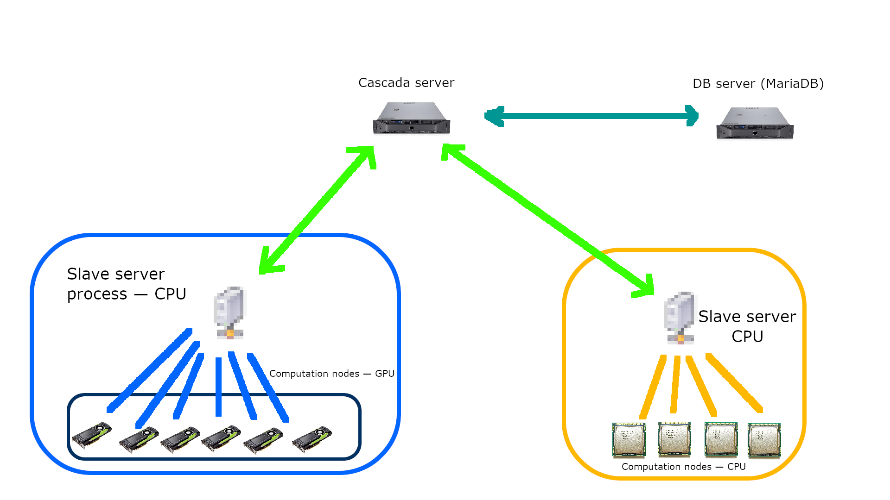
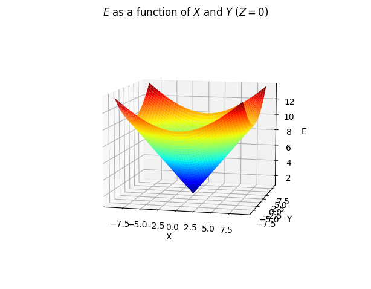
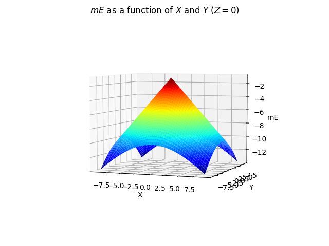
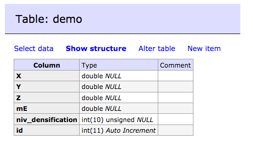
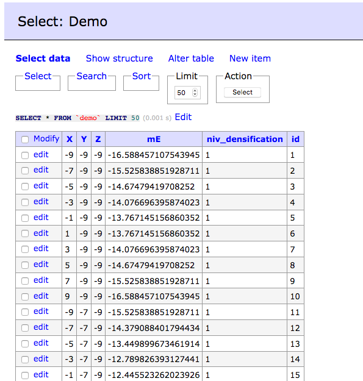
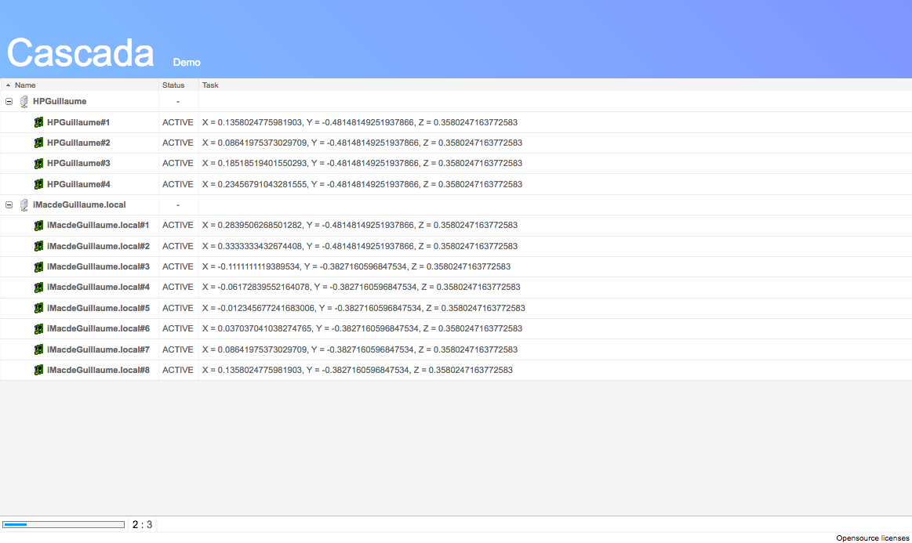
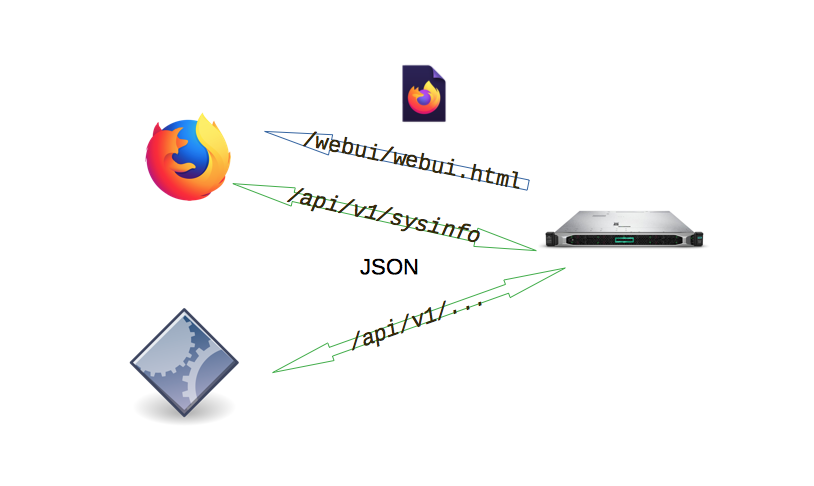

# Cascada

> A task generator and dispatcher


## Basic Overview

The cascada (master) server enables you to efficiently distribute computational tasks across several computers. Provide the server with a set of variables and a discrete interval for each of them, and it'll generate the possible tuples of values that it'll then send to the slave servers.

Using the computed values, the server will be able to find out the most promising values and adjust its search to explore new possible values close to these, in the search of the best possible result.

The web UI enables you to see how the computations are going.

## Install

### Dependancies

To use Cascada, you'll need the Python 3 (tested on Python 3.8), and the following Python libraries:
- numpy
- bottle

Additionally, you will need a MySQL/MariaDB server: the master server needs it to store the results it gets from the slave servers.

### Server setup

Setting up the server is rather straightforward. 

1. Clone the repo
2. Edit `db_cred.json` to add the credentials to the MySQL server (the account used must be able to create tables, and read/insert in them)
3. Customize `main.py` to suit you needs (see below)

That's it ! You can now run the server with `python3 example.py`.


## Usage

### How it works

#### Terminology

In this README — and, more broadly, in the rest of the code — the **master server** designates the server the Cascada server is running on. The **slave servers** (sometimes referred to as **master clients**) are seperate computer programs that may or may not be running on the same hardware as the master server.

Each slave server will tell the master server about the number of **nodes** available to perfoms the computations: each node maps a computation unit on the slave server. These nodes will be attributed **tasks** (a task per node) to compute. Once they're done, the result is sent back to the server, that will give them another task to perform and so on.

Thanks to the abstraction provided by the concept of nodes, it is possible to have several computers using vastly different hardware cooperate on the same project: nodes can be anything from CPU threads to OpenCL work-items; it is the responsability of the programmer creating the slave servers to implement nodes in the most efficient way possible.



#### Tasks

A task is described in terms of the variables it involves. Let's take a simple example: say we have three real numbers *X*, *Y* and *Z* and we wish to approximate the minimum of *E = √(X² + Y² + Z²)+1* using Cascada. We've done some research beforehand and know that the values of *X*, *Y* and *Z* yielding said minimum are in [-9, 9].



First, we'll tell Cascada that we have 3 real numbers that we name *X*, *Y* and *Z* and using these we will compute a real number named *E*. The server doesn't need to know how we're going to do it, but only that *X*, *Y* and *Z* are parameters, and *E* is the result of a computation based on them.

#### Distribution

What we're going to do is tell Cascada to take 10 (evenly distributed) values for each of the 3 intervals, ie -9., -7., -5.…, 7., 9., thus generating 10³ configurations. These configurations will be serialized to JSON and sent to the slave servers to compute E. These programs are most likely using the [Cascada client library](todo.org) to communicate with the server.

#### Densification

The master server then selects the most promising points; the number of "most promising points" being deduced from a selection ratio provided by the user. For each of these points, the server will create an interval centered on said point (and guaranteed to be included in the first interval), and will generate new configurations based on values sampled for said interval.

There's a small caveat though: __Cascada seeks only *maxima*, not *minima*__; the fix is really simple though: when coding the client, we will not compute *E* but rather *-E*. Cascada doesn't care about the *meaning* of variables, but only their value. However, to keep track of this change, let's say we told Cascada that we were computing a variable named *mE* ("minus *E*") instead of *E*.




Getting back to our example, here are the top configurations when it comes to maximizing *mE*


|X|Y|Z|mE|
|-|-|-|- |
-1|-1|-1|-2.73205...
1|-1|1|-2.73205...
-1|1|1|-2.73205...
-1|1|-1|-2.73205...
-1|-1|1|-2.73205...
1|-1|-1|-2.73205...
1|1|1|-2.73205...
1|1|-1|-2.73205...
-3|1|1|-4.31662...
And so on.

Let's say that we told Cascada to only keep the top 0.4% of the computed configurations; in our case, this amounts to only 4 configurations.

For each of these 4 configurations, Cascada will find the largest possible interval containing the configuration and delimited by its neighboring configurations (regardless if these were selected or not). For the configuration *(-1, -1, -1)*, it is [-3, 1]x[-3, 1]x[-3, 1]; for the configuration *(1, -1, -1)*, it is [-1, 3]x[-3, 1]x[-3, 1].

Let's see what happens with the *(-1, -1, -1)* configuration. We immediately notice that its corresponding hyperractangle's ([-3, 1]x[-3, 1]x[-3, 1]) Lebesgue Measure (ie "volume") is much smaller than the original interval's one (8 vs 5832).

Cascada will "zoom in" by a factor given by the user, and sweep through with smaller steps (for instance 0.25 instead of 2.), thus increasing the resolution of the discretization near the most promising points. The clients will fetch these new configurations. Once that the configurations derived from *(-1, -1, -1)* will be exhausted, Cascada will go on to deal with *(1, -1, 1)*, etc. 

When each initally selected configuration will be dealt with, the densification process will be repeated (for a number of times set by the user).

Of course, this might seem a bit overkill for this given task, but keep
in mind that this is only a mere example. 


### Code


Let's follow through with our example and describe it server-side.
You'll find the complete code in example.py; we only focus here on what's relevant.

#### Describing the variables

First of, we need to describe the scheme of the variables to Cascada. This is done quite simply: 

```
server_scheme = {"X": csc_float, "Y": csc_float, "Z": csc_float}
client_scheme = {"mE": csc_float}
```

The keys are the variable names; the value their type. **The names `niv_densification` and `id` are reserved and SHOULD NOT BE USED**.

Because the master server has to integrate with efficient programs running on the slave servers, Cascada uses types to describe the variables. 

The supported types are as follows:

| Type | Explaination|
|-|-|
|csc_float| An IEEE 754 float
|csc_double| An IEEE 754 double
|csc_uint64| An unsigned 64 bit integer|
|csc_uint32| An unsigned 32 bit integer|
|csc_uint8 | An unsigned 8  bit integer|
|csc_int64 | A signed 64 bit integer|
|csc_int32 | A signed 32 bit integer|


Notice that the variables computed by the client are separated from the
parameters computed by the server. Internally, they are treated very differently: the server doesn't know how to compute *mE* but knows very well what to do with *X*, *Y*, and *Z*, because that's what our very next variable is all about:

```
range_scheme = {
                    "X": (-9, 9, 10, np.linspace),
                    "Y": (-9, 9, 10, np.linspace),
                    "Z": (-9, 9, 10, np.linspace)
                }
```

Let's explain the meaning of the keys. It is a 4-value tuple:
1. The minimum value for the variable
2. The maximum value for the variable
3. The number of points to draw
4. How to draw them; ie a function that takes (in this order) the min, max and number of values and creates a object that contains these values.


Then, we need to bind `server_range` to `range_scheme`. This is done through the `Sequenceur` class:

```
sequencer = Sequenceur(server_scheme, range_scheme)
```

Finally, we'll wrap everything up by creating a `ProjetCascada` object

```
my_project = ProjetCascada("Demo",
                            sequencer,
                            server_scheme,
                            client_scheme,
                            "mE",
                            3, 0.04, 1,
                            "password"
                            "aVeryEfficientAlgorithm")
```

There is quite a lot of parameters, so don't hesitate to take a look at the documentation !

1. The name of the project; the name must be a valid SQL table name
2. Our `Sequenceur` object
3. The server scheme
4. The client scheme
5. The client scheme's variable name that Cascada will use to select the
    best records.
6. The number of iterations of the densification process that should be made. If set to 0, no densification will occur.
7. The selection ratio
8. The "zoom" factor used during the densification
9. The password the clients will use when connecting
10. The name of the algorithm the program running on the slave server should
    use, which it may or may not do (the master server has no way to check)
11. Not specified here, but a function used to validate the results coming from the client before saving them. If they fail the validation, the configuration will be reallocated. See the docstring for more details.

#### Launching the server

This is by far the easiest step: just load the project:

```
server.init(my_project)
```

This will trigger several processes such as the automagical creation of the table that will contain the results.


Then, launch the server:

````
server.launch(port=8088, host='0.0.0.0')
````

If you've configured the Python base logging module in the `main.py` file, the server will log the events.

Using `adminer` (or any other tool), you can connect to the database given in `db_creds.json`: the table `Demo` should have been created.



You may have noticed that there are two more fields:
- `niv_densification` is used by the server to store the densification level at which the record was computed
- `id` is used as a primary key

Once that clients will have connected and that tasks will be completed, the database will start filling up:




### The webUI

Now that the server's been launched, you may want to see what's hapenning and what slave servers are connected. This is where the webUI comes in handy. 

The webUI is served statically at the path `/webui/webui.html`. The webUI lists dynamically fetchs all the slave servers connected, their nodes and the tasks that were allocated for them.

It is powered by [Oleg Sklyanchuk's great TreeJS library](https://github.com/olegskl/TreeJS).



In this example, there are two slave servers connected (`HPGuillaume` and `iMacdeGuillaume.local`), running on two different computers, with respectively 4 and 8 nodes.


The same server handles both serving the webUI and handing out tasks to the client. The API used by both the client and the webUI is exposed by the server at `/api/v1/`.




### Enhancing security

To prevent malicious clients from connecting to the server and giving fake results, a (very simple) authentification scheme is provided. The master server expects the connecting clients (ie slave servers) to give a password. Once authentificated, the client is assigned a token string (which acts like a cookie) that it will transmit each time it does a request.

The issue lies within the initial handshake: in the current state of the server, everything is done over HTTP. Another issue — albeit less critical — is that the webUI can be accessed by anyone.

To kill two birds with one stone, one could use a reverse proxy to ensure that the traffic is sent over the newtork as HTTPS and that access to the webUI is restricted by an HTTP basic authentification.

On a side note, one should never leave an untrusted user choose the name of the project or the name of the variables, because these are passed directly to the SQL server (it seems there are no ways to escape them properly in an elegant fashion), which makes it easy to perform a SQL injection.

This isn't quite as a big issue as it would seem at first glance, given that these parameters are hardcoded in `main.py`. In the current state of things, the only way for someone to change them would be to directly access and manipulate the Python code. If an attacked can do such a move, it is likely he can also access `db_cred.json` which contains the login info used by the Cascada server to connect to the database; by doing so, he wouldn't even need to perform a SQL injection but could instead directly log into the SQL server.

## Final notes

### The Cascada configuration language

The developpement of Cascada started with a special-purpose strongly-typed configuration language for Cascada, that aimed at allowing the user to describe the schemes in a secure way, and to create new counters.

The developpment of said language was halted because it took too much time for very little benetifs, but not before several capabilites were implemented. Said capabilities are:
- declaring variables
- assigning values to variables
- binding variables together (just like two pointers would point on the same underlying object)
- launching commands with some type-checking in place (before launching the command, the interpreter checks whether the syntax is accepted by the command)

Under the hood, the parsing part is quite primitive, and many things (such as the use ASTs) should be added.

Files related to the Cascada configuration language are provided in `parser.py` and `shvars.py`. While in a working state state, they are not sufficiently developped to be of use in the rest of the program; the files are included for reference only.

To declare variables, use the `let` command:

```let [vartype] [varname] = [value]```

Where `vartype` is one of the following:

|||
|-|-|
|int64|uint64|
|int32|uint32|
||uint8|
|float||
|double||

You can also use the shorter ```[vartype] [varname] = [value]```

To list all avaible commands, use `lscmd`.

### Possible improvements

Below are listed possible improvements that could be done:

- Allow the user to specifiy a scheme without modifying the Python code. One could use a JSON file to specify the problem's variables and project's properties (simple), or improve the Cascada condiguration language (more complicated).
- Implement a way to see the current best result in the webUI (quite simple)
- Cache the status data (used by the WebUI) and only refresh them after X seconds
- Implement a keepalive for the clients
- Modify `db.py` to allow using SQLite instead of MySQL/MariaDB
- When the server restarts after having started a task, it should resume from where it was, so as to avoid redoing any (potentially time-consumming) computation. While it is already the case, the server starts from zero and for each configuration generated it checks its existance in the database; if it already exists, the configuration is skipped and not handed to the clients. This is not a very efficient behavior: it can sometimes take several minutes for the server to reach its past position. While it is resuming, no client can connect. This does however works well if the databse if fragmented. A solution should be found to make the resuming process faster. This should be considered the top priority issue.
- Allow the master server to allocate whole chunks of tasks to other, sub-master servers that could then distribute them to the slave servers to increase scalability.
